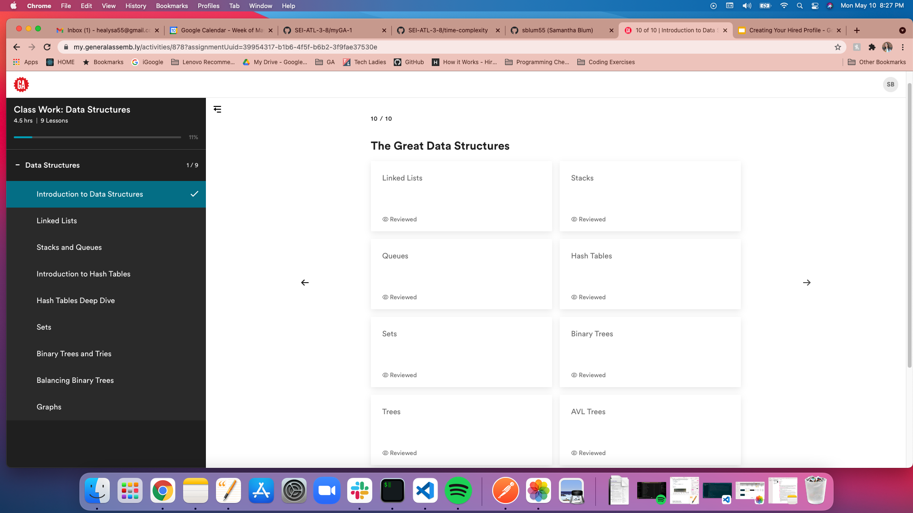
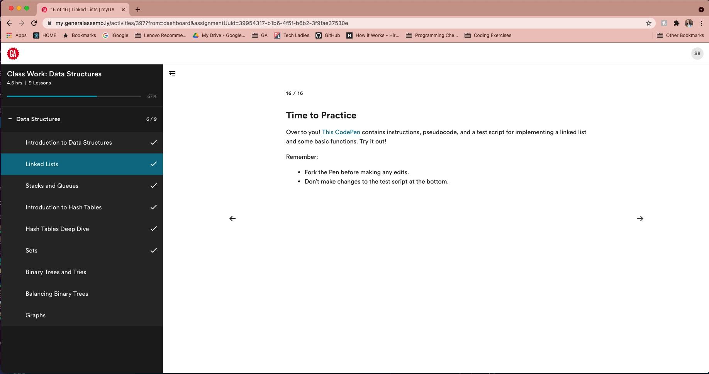
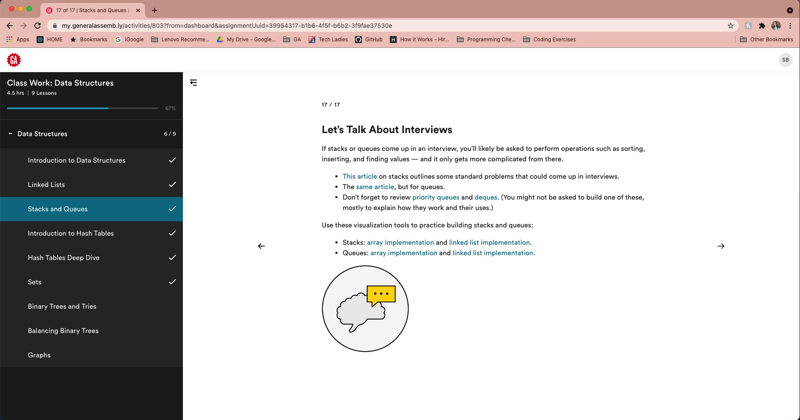
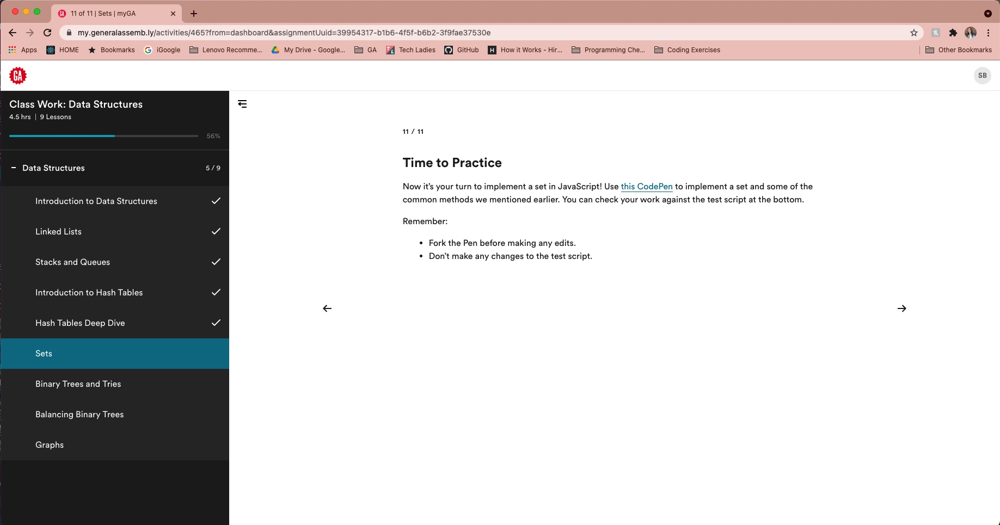
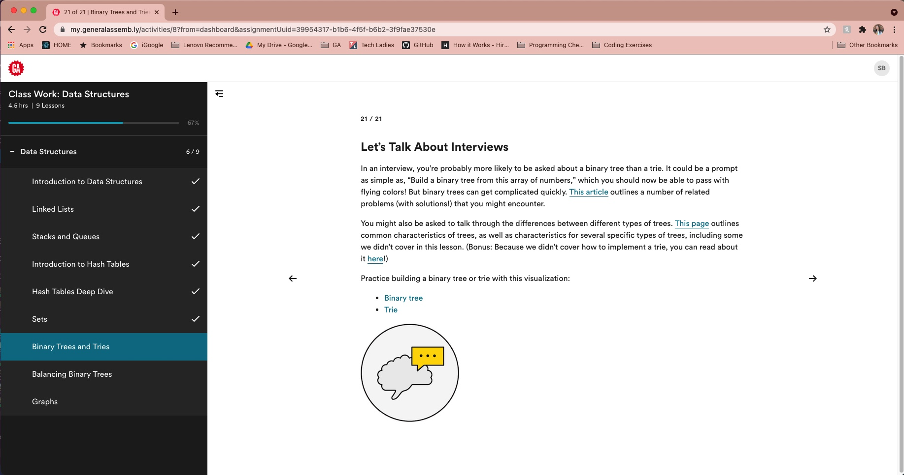
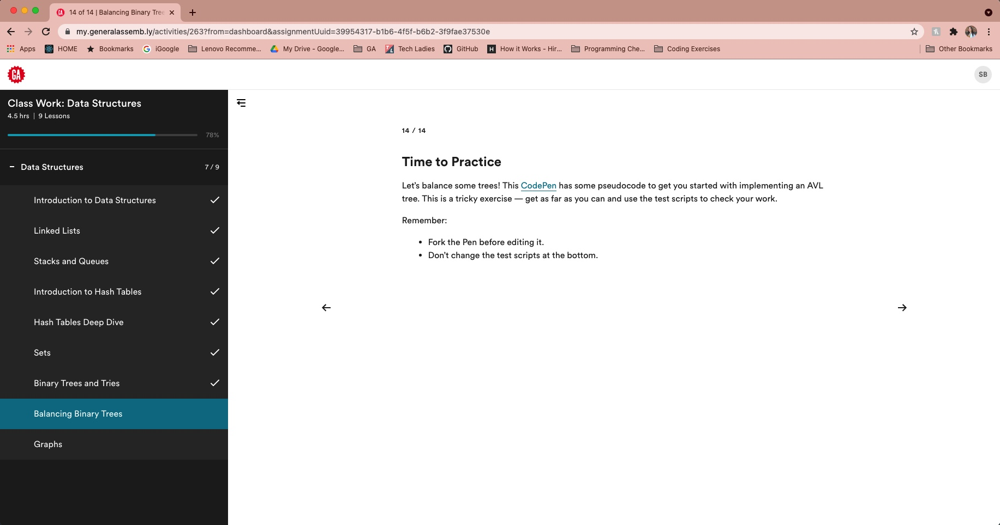
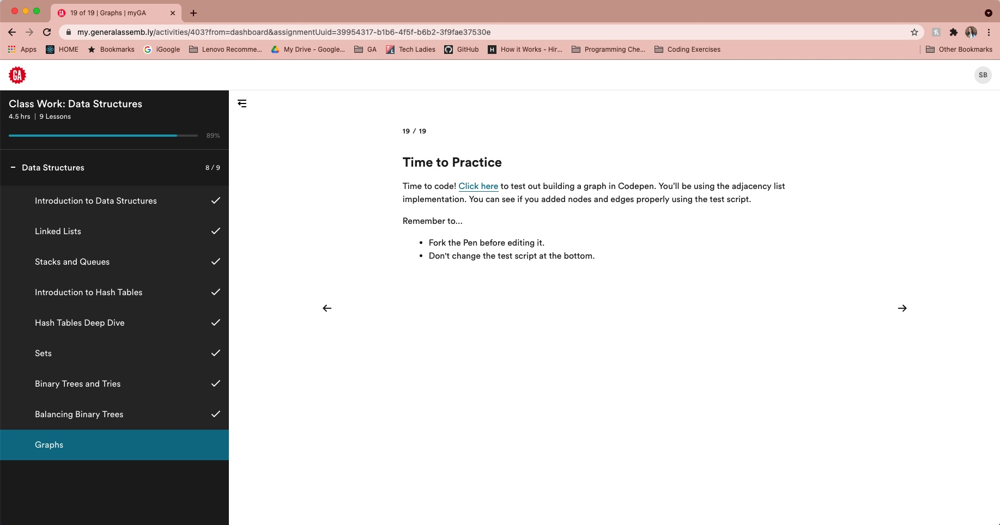

# myGA-3
Log into https://my.generalassemb.ly/

- Within the Data Structures section, do:
  - Introduction to Data Structures
  
  - Linked Lists
  
  - Stacks and Queues
  
  - Sets
  
  - Binary Trees and Tries
  
  - Balancing Binary Trees
  
  - Graphs
  

For each section, take a screencap of the final slide of that section. Put those screencaps into this folder, add & commit them, push them up to your branch, and make your pull request.
